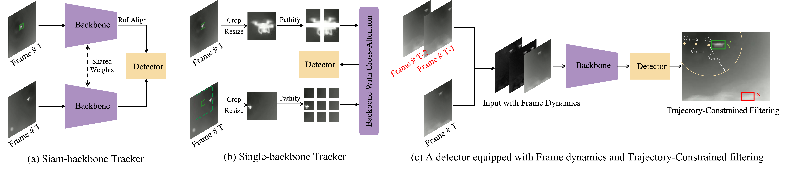

## A Simple Detector with Frame Dynamics is a Strong Tracker [](https://arxiv.org/abs/2505.04917)

> **[A Simple Detector with Frame Dynamics is a Strong Tracker]**</br>
> Chenxu Peng, Chenxu Wang, Minrui Zou, Danyang Li, Zhengpeng Yang, Yimian Dai, Ming-Ming Cheng, Xiang Li</br>
> *In The 4th Anti-UAV Workshop (CVPRW), 2025*
[[中文解读](https://zhuanlan.zhihu.com/p/1898471813731816565)]


### News
- `2025/05/07`: Our paper was honored with the Best Paper Award at the CVPR Anti-UAV Workshop!
- `2025/04/21`: We released our code!
- `2025/03/10`: We achieved first place in Track 1 and second place in Track 2 of the 4th Anti-UAV Competition (CVPRW 2025)!

### Dataset Preparation
Prepare the raw dataset, or download the [manually filtered version](https://pan.baidu.com/s/1pUarQ6Wi9_2KauirfQJIqw) with unreliable annotations removed (Password:i285).
```
/Data/train/
├── 01_1751_0250-1750
│   ├── 000001.jpg
│   │── ...
│   └── IR_label.json
├── 01_2192_0001-1500
│   ├── 000001.jpg
│   │── ...
│   └── IR_label.json
└──...
    ├── 000001.jpg
    │── ...
    └── IR_label.json 
```
#####  Cross-validation split
Compute similarity between different sequences using image matching algorithms such as SuperPoint and LightGlue.
```shell
python ./LightGlue/main.py  # similarity_results.json
```
Split sequences into training and testing sets based on similarity between sequences.
```shell
python ./LightGlue/gen_best_fold.py  # best_folds
```
Next, perform sampling on the sequences of each fold to obtain the final training and validation sets. The sampling interval can be freely set, such as every 5 or 10 frames.
```shell
python ./Data/train_valid_split.py  # best_folds 
```
Finally, based on the cross-validation splits and the sampling results, write a script to extract the corresponding data and generate the cross-validation sets. Then, convert the data into the MMDetection or YOLO format as needed(Code omitted here).

### Methods
#### 1.Frame Dynamics
Determine the target dataset to be used, and convert both its training and validation sets into the required format(Yolo or MMdet format).
Select one of the two: generate an optical flow or frame difference dataset for training.
```shell
python ./Data/gen_frame_diff.py    # frame difference
# or
python ./Data/gen_optical_flow.py  # optical flow
```
#### 2.TC-Filtering
TC-Filtering can be applied either during the post-processing stage of object detection inference or at the final model ensembling stage. 
Here, we only provide the code for model results ensemble. First, the detection results that need to be fused and the data that needs to be inferred should be organized into the given format (./TC_Filtering/results).
Then, run the following code according to your own requirements:
```shell
python ./TC_Filtering/code_concat.py
python ./TC_Filtering/code_pirorfilter.py
python ./TC_Filtering/code_max_to_1.py
python ./TC_Filtering/code_wbf.py
```

### Installation

```shell
conda create -n your_name python==3.10 -y
conda activate your_name
python -m pip install -r requirements.txt
```
### Citation

If you use this in your research, please cite this project.

```bibtex
@article{peng2025a,
	title={A Simple Detector with Frame Dynamics is a Strong Tracker},
	author={Chenxu Peng, Chenxu Wang, Minrui Zou, Danyang Li, Zhengpeng Yang, Yimian Dai, Ming-Ming Cheng, Xiang Li},
	journal={arXiv preprint arXiv:2505.04917},
	year={2025}
}

@article{peng2025a,
  title={A Simple Detector with Frame Dynamics is a Strong Tracker},
  author={Chenxu Peng, Chenxu Wang, Minrui Zou, Danyang Li, Zhengpeng Yang, Yimian Dai, Ming-Ming Cheng, Xiang Li},
  booktitle={CVPRW},
  year={2025}
}

```
